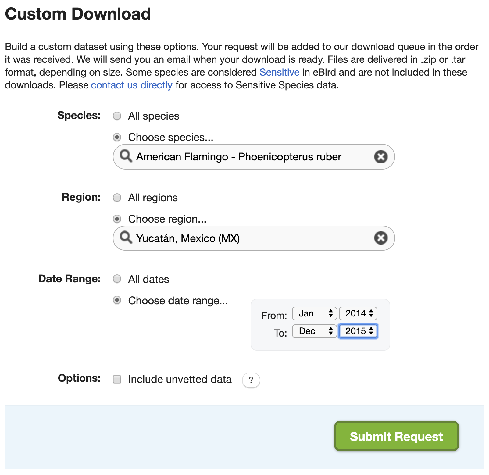

# Advanced Topics {#advanced}

## Preparing for occupancy modeling {#advanced-unmarked}

One common use of eBird data is for occupancy modeling with the R package `unmarked`. We'll cover occupancy modeling in detail in [Part II](#occupancy) of this workshop; however, `unmarked` requires data to be formatted in a very particular way and `auk` contains functions to do this, which we'll cover in this lesson. We'll continue with the American Flamingo data generated in Lesson \@ref(presabs).

First, we need to extract a subset of observations that are suitable for occupancy modeling. In particular, occupancy models typically require data from repeated visits to a single site during a time frame over which the population can be considered closed. The `auk` function `filter_repeat_visits()` is designed to extract subsets of eBird data that meet these criteria.

For example, let's define the period of closure as the entire month of January in each year and a repeat visit as the same observer revisiting a site with same latitude and longitude at least twice. The relevant parameters in `filter_repeat_visits` are:

- `min_obs` and `max_obs`: the minimum and maximum number of repeat visits to a given site.  Occupancy modeling requires at least two visits to each site.
- `date_var`: the column name of the date variable used to define the period of closure.
- `annual_closure`: define the period of closure as the entire year. This works here because we've already subset the data to only keep observations from January, which results in the period of closure being the month of January in given year. The `n_days` argument can be used to define the period of closure more flexibly. 
- `site_vars`: a character vector of names of columns that define a site. This is typically the combination of variables defining the location (`latitude` and `longitude`) and observer (`observer_id`).

```{r advanced-unmarked-extract}
library(auk)
library(lubridate)
library(tidyverse)

# read in the american flamingo data
ebd_zf <- read_csv("data/ebird_amefla_zf.csv")
# extract data suitable for occupancy modeling
visits <- filter_repeat_visits(ebd_zf, 
                               min_obs = 2, max_obs = 10,
                               date_var = "observation_date",
                               annual_closure = TRUE,
                               site_vars = c("latitude", "longitude", 
                                             "observer_id"))
# entire data set
nrow(ebd_zf)
# reduced data set
nrow(visits)
# how many individual sites there are
n_distinct(visits$site)
```

Three new columns are added to the dataset when using the function `filter_repeat_visits()`: `site` is a unique site ID, `closure_id` identifies the primary period of closure (in this example the year), and `n_observations` is the number of visits to each site.

```{r advanced-unmarked-newvars}
visits %>% 
  select(site, closure_id, n_observations) %>% 
  head()
```

Now that we have data suitable for occupancy modeling, we need to reformat the data to be accepted by `unmarked`. The documentation for the `unmarked` function `formatWide()` outlines the details of this format. In the EBD, each row is a checklist; however, `unmarked` requires each row to be a site with the first column specifying the site ID and subsequent columns specifying whether the species was observed on each of the visits to that site. The next group of columns contains site-level covariates, those that vary between sites but are constant across visits to the same site, such as latitude, longitude, and any habitat covariates we might have. Finally, the observation-level covariates, such as distance and duration, each get a set of columns corresponding to the the presence-absence columns. Here's a simple example with some made up data to illustrate the format:

```{r advanced-unmarked-exdata, echo = FALSE}
options(knitr.kable.NA = "")
readr::read_csv("raw-data/unmarked-ex-data.csv") %>% 
  knitr::kable(format = "html") %>% 
  kableExtra::kable_styling(bootstrap_options = c("striped", "responsive"),
                            font_size = 11) %>%
  kableExtra::scroll_box(width = "100%",
                         box_css = "border: 0; padding: 0; ")
```

The `auk` function `format_unmarked_occu()` takes care of the reformatting for you. In this function, `site_covs` are the names of the site-level covariates and `obs_covs` are the names of the observation-level covariates.

```{r advanced-unmarked-format}
visits_um <- format_unmarked_occu(visits, 
                                  site_covs = c("latitude", "longitude"),
                                  obs_covs = c("time_observations_started", 
                                               "duration_minutes", 
                                               "effort_distance_km", 
                                               "number_observers", 
                                               "protocol_type"))
```

<div class="exercise">
  <h2>Exercise</h2>
  Explore both the `visits_um` and `visits` data frames. They contain the same data in different formats. Try to understand how one data frame was transformed into the other.
</div>

## Land cover covariates {#advanced-modis}

To use eBird data for modeling species distributions you'll typically want to attach habitat data to the checklists to use as model covariates. There are a wide variety of freely available, satellite-derived land use and land cover products available for use as covariates. The specific set of covariates you use, and the covariates that you derived them from, will depend on the specifics of your study: the focal species and region, and question you're asking. However, we recommend the [MODIS MCD12Q1](https://lpdaac.usgs.gov/products/mcd12q1v006/) land cover dataset as a good general use source of land cover covariates. This product is global in extent, available annually since 2001, and provided in a raster format at 500 m resolution.

The free [eBird Best Practices book](http://strimas.com/ebird-best-practices/covariates/) associated with this workshop covers in detail how to download land cover data and attach it to eBird checklists. However, we provide an overview of the process here.

1. **Download:** download land cover data (e.g. MODIS MCD12Q1) for your region of interest, either manually or using the R package `MODIS`. These data will often be downloaded in the form of multiple tiles that need to be combined together then converted to GeoTIFF format. This is done automatically if you're using the `MOIDS` package, but it can be done manually using the command line tool [GDAL](https://gdal.org/).
2. **Summarize:** birds use and respond to their environment at a scale that is typically larger than the resolution of the satellite data. Furthermore, there is uncertainty in the location of eBird checklists, particularly traveling checklists. So, you should usually summarize the data within a neighborhood of each checklist. This can be done most simply by calculating the percent of each land cover class within a neighborhood of each point.
3. **Prediction surface:** once you've fit your models using the land cover covariates you generated in the previous steps, you'll usually want to make predictions over the landscape and produce maps. This requires defining a regular grid of points at which you calculate the same land cover covariates as you did in the previous step.

To see the code for each of these steps consult the [eBird Best Practices](http://strimas.com/ebird-best-practices/covariates/) book.

## Custom downloads {#advanced-custom}

The full EBD is massive (over 200 GB) and takes a long time to process with `auk` (typically several hours). In some cases, there's a way around these issues. On the [EBD download page](https://ebird.org/data/download/ebd), there's a Custom Download form that allows you to request a subset of the EBD for a given species, within a region, and for a range of dates. After submitting a request, it will be processed on the eBird servers and an email will be sent to you with instructions for downloading the EBD extract.



Recall from the [lesson on zero-filling](#presabs-filter), that we extracted American Flamingo records from Mexico's Yucatán state in January, and produced presence-absence data from this extract. Let's try to do this with the Custom Download form. After the request is submitted an email will arrive with instrustions for [downloading the following file](https://github.com/mstrimas/ebp-workshop/raw/master/raw-data/ebd_MX-YUC_grefla2_201401_201512_relSep-2019.zip). Download and unarchive this file, placing the text file in the `data/` subdirectory of your project.

```{r advanced-custom-dl, echo = FALSE}
unzip("raw-data/ebd_MX-YUC_grefla2_201401_201512_relSep-2019.zip",
      "ebd_MX-YUC_grefla2_201401_201512_relSep-2019.txt", 
      exdir = "data/")
```

It will quickly become clear that there are two challenges with this approach. First, the set of filters available in the Custom Download form is limited. For example, there's no option to only extract observations from complete checklists or any way to get observations from a given month from any year. To address this, we can apply the additional filters after we've imported the data in R. Specifically, we'll only keep observations from complete checklists in January

```{r advanced-custom-filter}
ebd <- read_ebd("data/ebd_MX-YUC_grefla2_201401_201512_relSep-2019.txt") %>% 
  filter(month(observation_date) == 1, 
         all_species_reported)
```

The second challenge is that the Custom Download form only provides the positive observations from the EBD, it doesn't provide the corresponding Sampling Event Data for zero-filling. However, the Sampling Event Data is much smaller than the EBD and quicker to process with `auk`. So, we can easily filter this file using the same set of filters we've already applied to the EBD. Note that `auk_sampling()` is used in place of `auk_ebd()` when we're only filtering the sampling data and not the EBD.

```{r advanced-custom-sed}
f_sed <- "data/sed-only_amefla.txt"
sed_filt <- auk_sampling("ebd_sampling_2014-2015_yucatan.txt") %>% 
  auk_state("MX-YUC") %>% 
  auk_date(c("*-01-01", "*-01-31")) %>% 
  auk_complete() %>% 
  auk_filter("data/sed-only_amefla.txt")
sed <- read_sampling(f_sed)
```

<div class="tip">
  <h2>Tip</h2>
  This method will only work if the custom download data and the Sampling Event Data are from the same release of the EBD. The EBD is updated monthly, so you'll want to make sure you download a copy of the Sampling Event Data at the same time as you submit a custom download request.
</div>

Finally, we can combine these two data frames together with `auk_zerofill()` to produce zero-filled presence-absence data.

```{r advanced-custom-zerofill}
ebd_zf <- auk_zerofill(ebd, sed, collapse = TRUE)
```

We've produced exactly the same data as in Lesson \@ref(presabs); however, we've done so avoiding having to deal with the full EBD!

## Reducing file size {#advanced-size}

Even after filtering the EBD, sometimes it's still too large to read into R and work with. There are several approaches for reducing the size of the EBD. We'll cover three here: **stricter filtering**, **removing columns**, and **splitting by species**.

### Stricter filtering {#advanced-size-strict}

The most obvious way to reduce the size of an EBD extract is to use stricter filters: focus on a smaller region, shorter time period, or fewer species. To avoid having to waste several hours trying to filter the entire EBD all over again, it's worthwhile noting that you can always re-filter an EBD extract directly. So, if you realize you were too coarse in your initial filtering, apply the stricter filter to the EBD extract rather than the full EBD so save time.

### Removing columns {#advanced-size-columns}

The EBD contains a lot of columns (46 to be precise), many of which are redundant or not useful in most scenarios. For example, country, state, and county each have two columns, one for the name and one for the code. Other columns, such as the Important Bird Area (IBA) that a checklist belong to and the checklist comments, are rarely useful. By removing these columns we can drastically reduce the size of the EBD.

The available columns in the EBD are listed and defined in the PDF metadata that comes with the EBD (`eBird_Basic_Dataset_Metadata_v1.12.pdf`). Alternatively, there's a useful trick to get a list of column names from an `auk_ebd` object.

```{r advanced-size-columns-cols}
ebd <- auk_ebd("ebd_2014-2015_yucatan.txt")
ebd$col_idx$name
```

The function `auk_select()` will process the EBD to only keep the selected columns.

```{r advanced-size-columns-select}
cols <- c("latitude", "longitude",
          "group identifier", "sampling event identifier", 
          "scientific name", "observation count",
          "observer_id")
f_select <- "data/ebd_smaller.txt"
selected <- auk_select(ebd, select = cols, file = f_select) %>% 
  read_ebd()
names(selected)
```

`auk_select()` is typically applied to a subset of the EBD to reduce the size before reading it into R. However, this function can also be applied to *entire* EBD to remove any columns that you're sure you'll never need. If you're running out of hard drive space, this approach can drastically reduce the size of the EBD and free up space.

<div class="exercise">
  <h2>Exercise</h2>
  Removing columns can also be done concurrently with filtering the EBD. Consult the documentation for `auk_filter()` and look at the `keep` and `drop` arguments. Use these to extract all Least Grebe records from Belize **and** remove the `trip comments` and `species comments` fields in addition to any other fields you feel aren't required.
  
  <button class="solution">Solution</button>
<div class="solution-content">

```{r advanced-size-columns-sol}
ebd_leagre <- ebd %>% 
  auk_species("Least Grebe") %>% 
  auk_country("BZ") %>% 
  auk_filter("data/ebd_leagre.txt",
             drop = c("trip_comments", "species_comments",
                      "country", "state", "county")) %>% 
  read_ebd()
```

</div>
</div>

### Splitting by species {#advanced-size-split}

If you're working with a large number of species, the size of the EBD can quickly increase. An easy way to address this before importing data into R is to split the EBD extract up into separate files, one for each species. You can then read in species one at a time and process them. Note that the Sampling Event Data doesn't need to be split and the same file can be used for each species EBD file.

The function `auk_split()` facilitates this process. You provide an EBD extract and a vector of species names and it will split the EBD up into species-specific files. In Lesson \@ref(applications) we extracted eBird data for 3 warbler species, let's use `auk_split()` to split this file up.

```{r advanced-size-split}
split_species <- c("Wilson's Warbler", "Canada Warbler", "Pink-headed Warbler")
f_split <- auk_split("data/ebd_cardellina.txt", 
                     species = split_species,
                     prefix = "data/ebd_split_")
f_split
```

Next, let's take the first of these files (for Wilson's Warbler) and zero-fill it using the Sampling Event Data we extracted in Lesson \@ref(applications).

```{r advanced-size-split-zf}
wilwar <- auk_zerofill(f_split[1], 
                       sampling_events = "data/sed_cardellina.txt",
                       collapse = TRUE)
```

When working with the full EBD, this approach is much faster because we only need to filter the EBD once instead of once for each species. This could be the difference between a few hours of processing time and a few days.

```{r part1-cleanup, echo = FALSE}
unlink(list.files("data/", full.names = TRUE))
```
